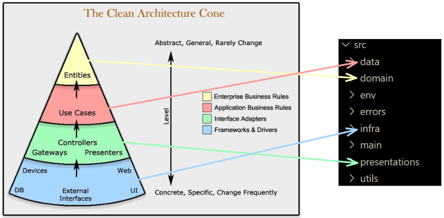
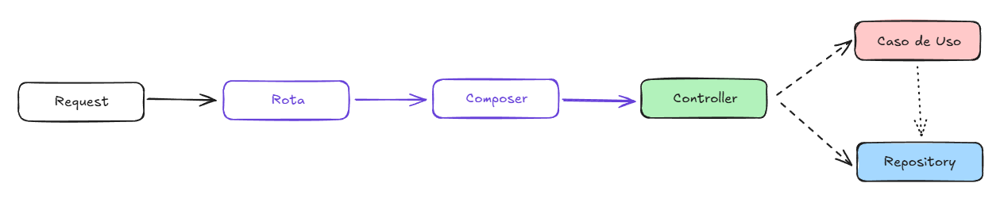

# Arquitetura

A arquitetura de software do Painel e-SUS APS é baseada no modelo *Clean Architecture* (Arquitetura Limpa), que trabalha em camadas com uma forte inspiração no Protocolo OSI.

As motivações para o uso desta arquitetura foi para lidar com mudanças frequentes nas regras de negócio e testar diferentes implementações rapidamente.

Representação do modelo aplicado ao código fonte do Painel

## Estrutura de diretórios e responsabilidades

### `data/`

Contratos e camadas de aplicação mais próximas de dados

- `interfaces/`: Portas do lado de saída (repository/gateway contracts) que o domínio consome. Definem como o domínio conversa com o mundo externo. Subpastas como `create_bases/` agrupam contratos por contexto.
- `use_cases/`: Implementações e variações orientadas a dados, composições específicas.

### `domain/`

Regras de negócio.

- `entities/`: Entidades de domínio (modelos centrais).
- `dict_types/`: Tipos estruturados/Value Objects do domínio.
- `use_cases/`: Casos de uso puros (sem dependências de infra), organizados por subdomínios.

### `env/`

Configuração de ambiente, além de manter parâmetros (ambiente, chaves, URLs, etc) desacoplados do código.

### `errors/`

Cross-cutting (infraestrutura compartilhada) de observabilidade e tratamento de error padronizado.

- `types/`: tipos/estruturas de erro.
- `logging.py`, `logger/`, `log/`: infraestrutura de logging.
- `config.py`, `error_handler.py`: configuração centralizada e manipuladores de erro.

### `infra/`

Implementações concretas dos contratos de `data/interfaces/` e integrações externas. Depende de frameworks/bibliotecas.

- `db/`: acesso a banco de dados, queries, conexões.
- `requests/`: clientes HTTP/REST para provedores externos.
- `bridge_provider/`: camadas de ponte para serviços/SDKs externos.
- `create_base/`: rotinas de preparação/criação de bases.

### `main/`

Inicia a aplicação e monta as dependências.

- `adapters/`: adaptadores entre HTTP/framework e controladores/casos de uso.
- `composers/`: composição/injeção de dependências conectando controladores, casos de uso e repositórios concretos da `infra/`.
- `routes/`: definição das rotas/endpoints e apontamento para os controladores.
- `server/`: bootstrap do servidor/aplicação.

### `presentations/`

Adapta a camada de entrada (HTTP/UI) para o domínio e não contém regras de negócio.

- `controllers/`: controladores de interface (HTTP/controller) que recebem a requisição, validam entrada, chamam casos de uso e formatam a resposta.
- `validators/`: validação de payloads de entrada.
- `helpers/`: auxiliares de formatação/conversão do layer de apresentação.
- `http_types/`: contratos de Request/Response/Status, padronizando a camada HTTP.
- `interfaces/`: contratos para controladores/apresentação.

### `utils/`

Utilidades compartilhadas e helpers.

### Refatorações futuras

- Remover códigos legados
- Remover entidades não utilizadas
- Refatorar testes

### Fluxo de Requisição

# Desenvolvimento

## Requisitos

- Python 3.10
- Docker
- OpenVPN client (recomenda-se Pritunl)

## Instalação

### Pré-configurações

- conectar VPN

- criar `.env` no diretório do back-end
    - `cp painel-esus\.example.env painel-esus\.env`

- caso queira inicializar o front-end localmente, atualize o Dockerfile comentando os comandos referentes ao front-end
    - `# RUN mkdir paineis-v2-front`
    - `# COPY ./paineis-v2-front/static-files ./paineis-v2-front/static-files`

-  se necessário, atualize o `.env` para não fazer build da base
    - `GENERATE_BASE=False`

- se necessário, atualize `.dockerignore` comentando o glob pattern `**/.env`

### Configurações do Docker

- Faça o build da imagem
    - `docker build -t painel-esus-flask .`

- Inicie o container
    - `docker run -d -p 5001:5001 --name painel-esus-flask-container painel-esus-flask`

    - Se preferir, use volume:
        - `docker run -d -v <PATH>\painel-esus\painel-esus:/app" -w /app -e FLASK_ENV=development -p 5001:5001 --name painel-esus-flask-vol painel-esus-flask python run.py`

### Inicializar o front-end

- `cd paineis-v2-front && yarn install`
- `yarn start`

