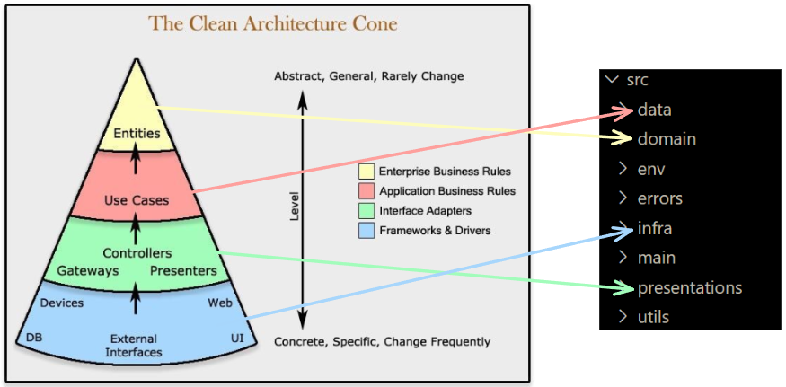

# Introdução

A arquitetura de software do Painel e-SUS APS é baseada no modelo *Clean Architecture* (Arquitetura Limpa), que trabalha em camadas com uma forte inspiração no Protocolo OSI.

As motivações para o uso desta arquitetura foi para lidar com mudanças frequentes nas regras de negócio e testar diferentes implementações rapidamente.

Representação do modelo aplicado ao código fonte do Painel

## Fluxo de Requisição

## Refatorações futuras

- Remover códigos legados
- Remover entidades não utilizadas
- Refatorar testes

