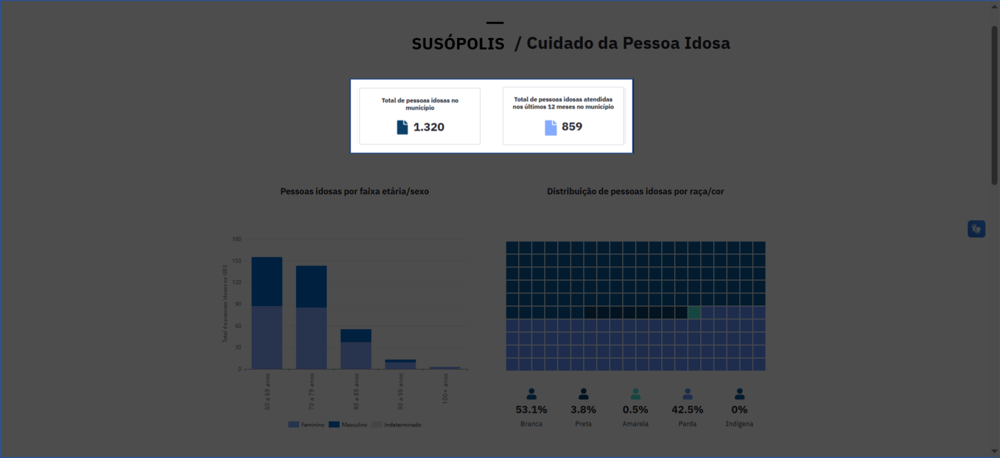
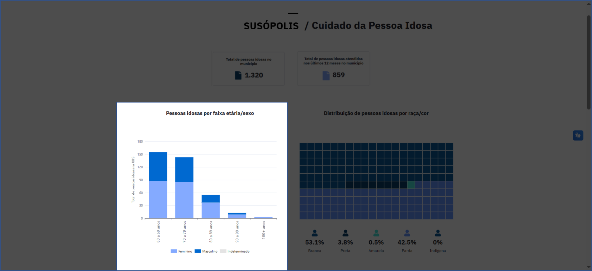
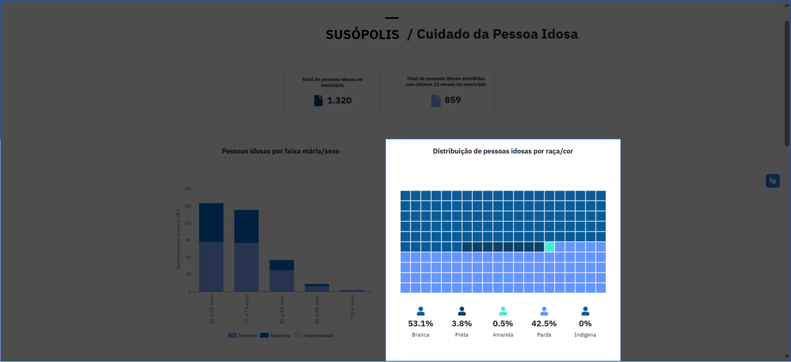
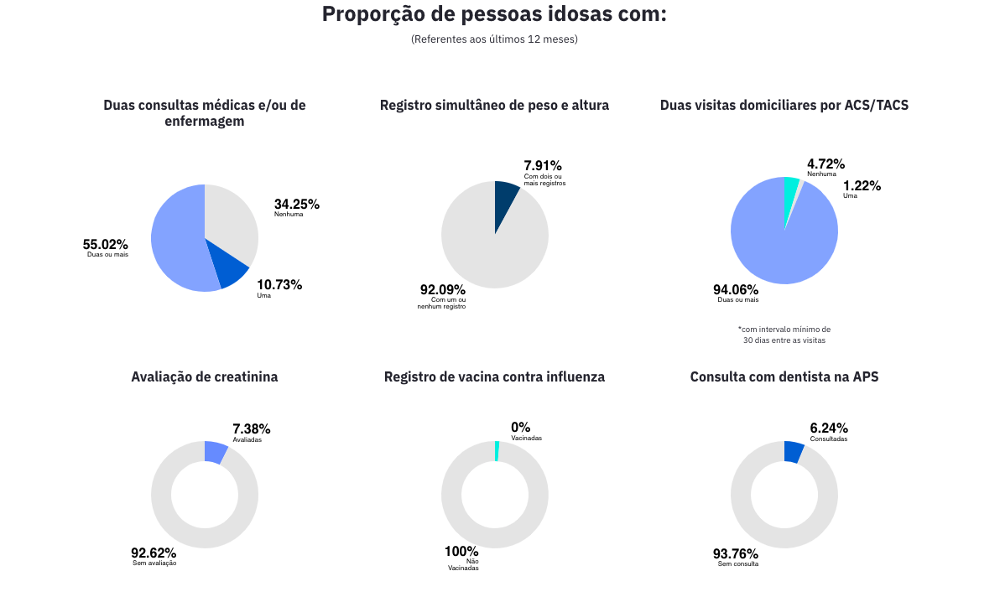
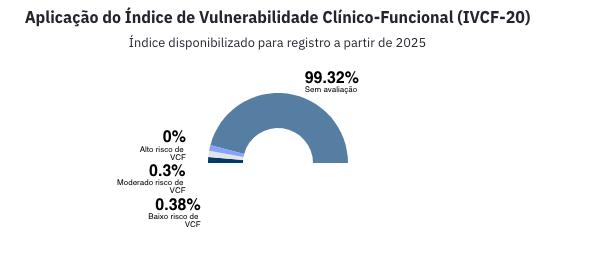
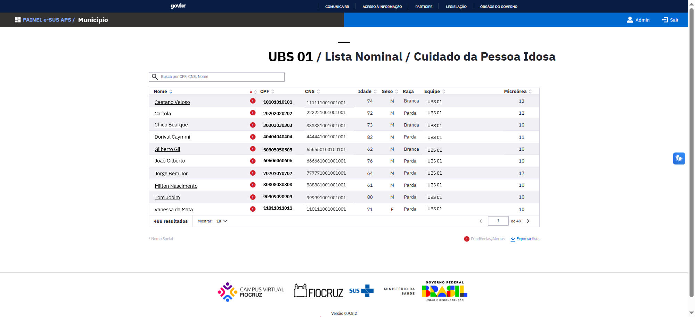
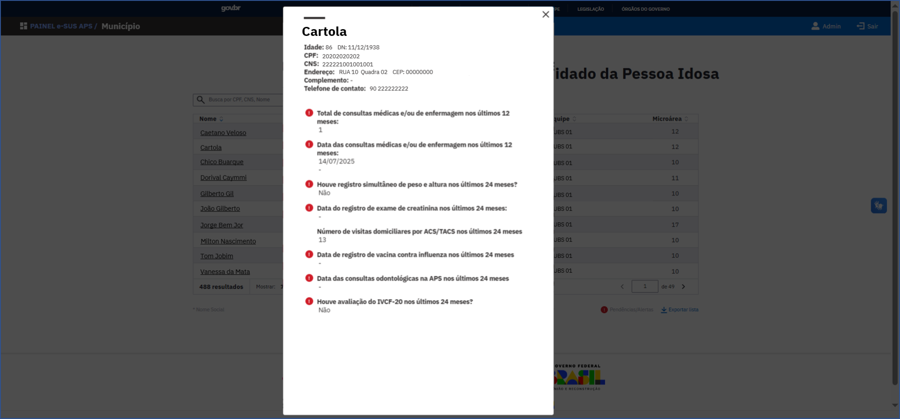

# Relatório Temático de Cuidado da Pessoa Idosa

O Relatório Temático de Cuidado da Pessoa Idosa apresenta informações relacionadas ao cuidado dos cidadãos de 60 anos ou mais de idade — com cadastro ativo na **Ficha de Cadastro Individual** — ou seja, sem registro de óbito ou mudança de território na última atualização — vinculados a uma equipe de saúde da família do município. Os valores apresentados estarão sempre relacionados ao nível de visualização escolhido previamente: Município, Unidade Básica de Saúde (UBS) ou Equipe, como nos demais relatórios.

## Fontes de dados

Os dados do relatório são provenientes das seguintes fichas:

- **Ficha de Cadastro Individual**
- **Ficha de Atendimento Individual**
- **Ficha de Visita Domiciliar**
- **Ficha de Atendimento Odontológico**

Além de informações da [Tabela de Acompanhamento de Cidadãos Vinculados](https://integracao.esusab.ufsc.br/dw/visualizacoes/acompanhamento_cidadaos_vinculados.html).

## Total de pessoas idosas cadastradas e atendidas

Pessoas de 60 anos ou mais com a idade extraída a partir da data de nascimento do cidadão, informada na última atualização do seu cadastro. O total de cidadãos nesta faixa de idade que estão cadastradas e as que foram atendidas nos últimos 12 meses, de acordo com a visualização escolhida, são apresentados nos cards, conforme indicados na imagem a seguir:

*Total de pessoas cadastradas e atendidas no município*

## Pessoas idosas por faixa etária/sexo

Pessoas de 60 anos ou mais com a idade extraída a partir da data de nascimento do cidadão, informada na última atualização do seu cadastro. Estratificadas segundo o **sexo** (Masculino e Feminino), nas suas respectivas **faixas de idade**:

- 60 a 69 anos
- 70 a 79 anos
- 80 a 89 anos
- 90 a 99 anos
- 100 anos ou mais

O total de pessoas por sexo pode ser visualizado quando o(a) usuário(a) posicionar o cursor em cada parte do gráfico.

*Pessoas idosas por faixa etária/sexo*

## Distribuição de pessoas idosas por raça/cor

Pessoas de 60 anos ou mais com a idade extraída a partir da data de nascimento do cidadão, informada na última atualização do seu cadastro. Distribuídas segundo a **raça/cor** (Branca; Preta; Amarela; Parda; Indígena; e Não informado). Ao posicionar o cursor no gráfico, é possível verificar os totais de pessoas em cada categoria.

*Distribuição de pessoa idosas por raça/cor*

## Indicadores de boas práticas no cuidado da pessoa idosa

Neste relatório são apresentados indicadores relacionados às boas práticas no cuidado da pessoa idosa:

### Proporção de pessoas idosas com duas consultas médicas e/ou de enfermagem

O gráfico apresenta a porcentagem de pessoas de 60 anos ou mais com cadastro e vínculo ativo, que tiveram duas consultas médicas e/ou de enfermagem nos últimos 12 meses, distribuídas nas seguintes categorias:

- **Duas ou mais** (indivíduos que cumpriram o critério)
- **Uma** (indivíduos que tiveram apenas uma consulta)
- **Nenhuma** (indivíduos que não realizaram nenhuma consulta)

### Proporção de pessoas idosas com registro simultâneo de peso e altura

O gráfico apresenta a porcentagem de pessoas de 60 anos ou mais com cadastro e vínculo ativo, que tiveram registros simultâneos de peso e altura ocorridos na data das consultas com médico e/ou enfermeiro, realizados nos últimos 12 meses, distribuídas nas seguintes categorias:

- **Com dois ou mais registros** (indivíduos que cumpriram o critério)
- **Com um ou nenhum registro** (indivíduos que não atingiram o critério)

### Proporção de pessoas idosas com duas visitas domiciliares por ACS/TACS

O gráfico apresenta a porcentagem de pessoas de 60 anos ou mais com cadastro e vínculo ativo, com duas visitas domiciliares de ACS ou TACS com intervalo mínimo de 30 dias entre as visitas, realizadas nos últimos 12 meses, distribuídas nas seguintes categorias:

- **Duas ou mais** (indivíduos que cumpriram o critério)
- **Uma** (indivíduos que tiveram apenas uma visita)
- **Nenhuma** (indivíduos que não tiveram nenhuma visita)

### Proporção de pessoas idosas com avaliação de creatinina

O gráfico apresenta a porcentagem de pessoas de 60 anos ou mais com cadastro e vínculo ativo, com avaliação de creatinina, nos últimos 12 meses, distribuídas nas seguintes categorias:

- **Avaliadas** (indivíduos que foram avaliados)
- **Sem avaliação** (indivíduos que não foram avaliados)

### Proporção de pessoas idosas com consulta com dentista na APS

O gráfico apresenta a porcentagem de pessoas de 60 anos ou mais com cadastro e vínculo ativo, que tiveram consulta com dentista na APS, nos últimos 12 meses, distribuídas nas seguintes categorias:

- **Consultadas** (indivíduos que tiveram consulta)
- **Sem consulta** (indivíduos que não tiveram consulta)

*Apresentação dos indicadores*

## Aplicação do Índice de Vulnerabilidade Clínico-Funcional (IVCF-20)

O gráfico apresenta a distribuição percentual das pessoas de 60 anos ou mais, que tiveram a aplicação do Índice de Vulnerabilidade Cínico - Funcional (IVCF-20), segundo os critérios da avaliação:

| Classificação | Pontuação |
|---------------|-----------|
| Alto risco de VCF | ≥15 pontos no resultado da avaliação |
| Moderado risco de VCF | 7 a 14 pontos no resultado da avaliação |
| Baixo risco de VCF | 0 a 6 pontos no resultado da avaliação |
| Sem avaliação | Indivíduos que não foram avaliados |

*Gráfico da distribuição do Índice de Vulnerabilidade Clínico-Funcional (IVCF-20)*

## Lista nominal das pessoas idosas

Ao final da página do relatório, há um botão clicável "Ver lista nominal", que permite acessar a lista correspondente.

A lista nominal contém o total de pessoas idosas (60 anos ou mais) vinculados à UBS ou à equipe selecionada para visualização.

A lista apresenta as seguintes informações de cada pessoa:

- **Nome**
- **CPF**
- **Cartão Nacional de Saúde (CNS)**
- **Idade**
- **Sexo**
- **Raça**
- **Equipe**
- **Microárea**

Ela também permite realizar buscas específicas por cidadão utilizando o número do CPF, CNS ou pelo nome, conforme demonstrado na ilustração abaixo.

:::warning Alerta
O símbolo de **Alerta**, em vermelho, indica situações que requerem atenção especial relacionadas à situação cadastral da pessoa.
:::

*Lista nominal cuidado da pessoa idosa*

### Detalhamento do cidadão

Ao clicar no nome do cidadão na lista nominal é possível visualizar, além dos dados pessoais do cidadão, informações adicionais, quando disponíveis, como:

- **Total de consultas médicas ou de enfermagem realizadas nos últimos 12 meses**
- **Informações sobre o registro de peso e altura dos indivíduos**
- **Registro de exames realizados**
- **Vacinas recebidas**

Entre outras informações relevantes.

*Card de detalhamento da pessoa e dos alertas*

