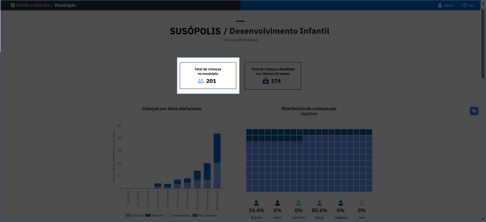
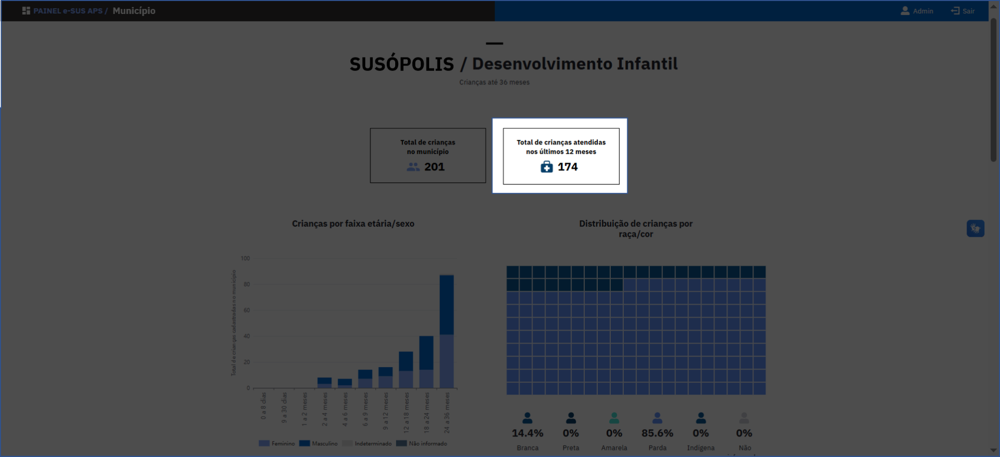
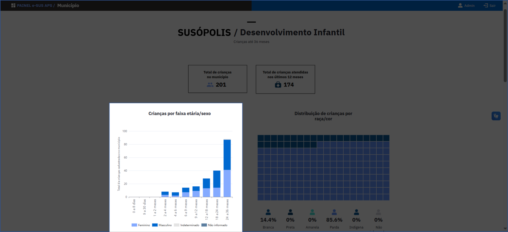
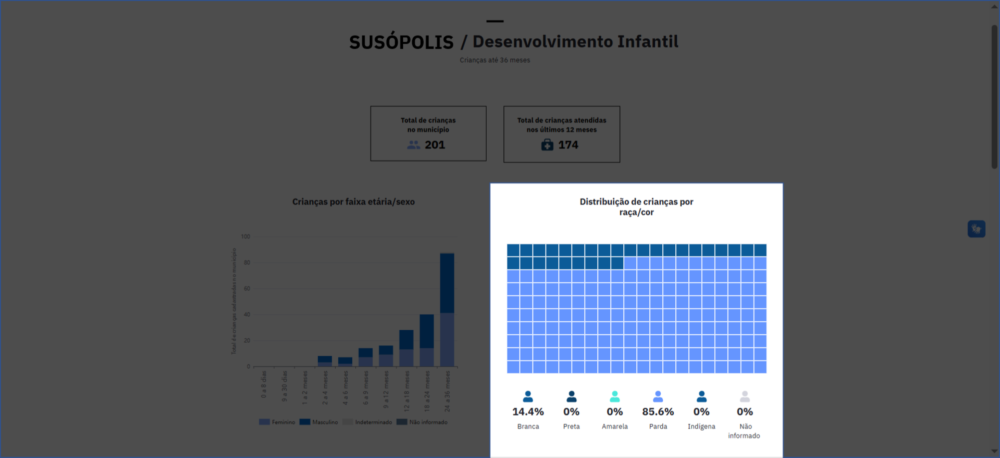
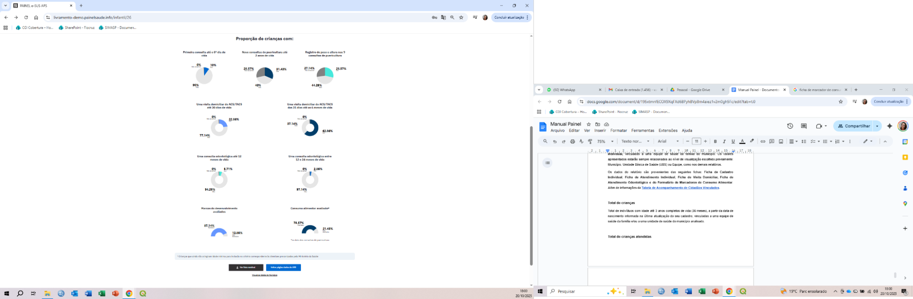
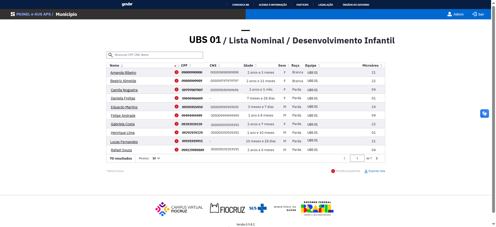
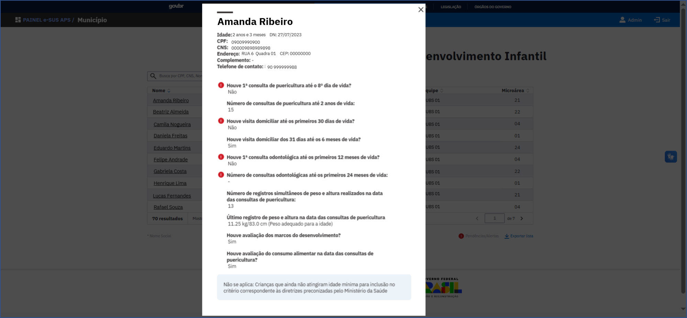

# Relatório Temático de Desenvolvimento Infantil

Neste relatório temático são apresentadas informações sobre o desenvolvimento infantil, com foco em crianças até 36 meses de idade, com cadastro ativo na **Ficha de Cadastro Individual**, vinculadas a uma equipe de saúde da família do município. Os valores apresentados estarão sempre relacionados ao nível de visualização escolhido previamente: Município, Unidade Básica de Saúde (UBS) ou Equipe, como nos demais relatórios.

## Fontes de dados

Os dados do relatório são provenientes das seguintes fichas:

- **Ficha de Cadastro Individual**
- **Ficha de Atendimento Individual**
- **Ficha de Visita Domiciliar**
- **Ficha de Atendimento Odontológico**
- **Formulário de Marcadores de Consumo Alimentar**

Além de informações da [Tabela de Acompanhamento de Cidadãos Vinculados](https://integracao.esusab.ufsc.br/dw/visualizacoes/acompanhamento_cidadaos_vinculados.html).

## Total de crianças

Total de indivíduos com idade até 3 anos completos de vida (36 meses), a partir da data de nascimento informada na última atualização do seu cadastro, vinculadas a uma equipe de saúde da família e/ou a uma unidade de saúde do município analisado.

*Total de crianças no município*

## Total de crianças atendidas

Total de indivíduos com idade até 3 anos completos de vida (36 meses), a partir da data de nascimento informada na última atualização do seu cadastro, vinculadas a uma equipe de saúde da família e/ou a uma unidade de saúde do município analisado que tenham realizado algum atendimento individual nos últimos 12 meses.

*Total de crianças atendidas nos últimos 12 meses*

## Crianças por faixa etária/sexo

Mostra o total de crianças cadastradas e vinculadas segundo categorias de **faixa etária** recomendadas para a realização das consultas de puericultura:

- 0 a 8 dias
- 9 a 30 dias
- 1 a 2 meses
- 2 a 4 meses
- 4 a 6 meses
- 6 a 9 meses
- 9 a 12 meses
- 12 a 18 meses
- 18 a 24 meses
- 24 a 36 meses

E por **sexo** (masculino / feminino / indeterminado).

*Crianças por faixa etária/sexo*

## Distribuição de crianças por raça/cor

O gráfico apresenta o total de crianças cadastradas e vinculadas segundo categorias de **raça/cor** (Branca / Preta / Parda / Amarela / Indígena / Não informada).

*Distribuição de crianças por raça/cor*

## Indicadores de Desenvolvimento Infantil

A imagem abaixo apresenta **nove gráficos de pizza**, cada um ilustrando a **distribuição percentual de crianças** para indicadores relacionados às boas práticas do Desenvolvimento Infantil:

1. **% de crianças que realizaram a primeira consulta de puericultura até o 8º dia de vida**
2. **% de crianças que realizaram pelo menos nove consultas de puericultura até 2 anos de vida**
3. **% de crianças com registro de peso e altura nas consultas de puericultura**
4. **% de crianças que receberam pelo menos uma visita domiciliar do ACS/ACS até os 30 dias de vida**
5. **% de crianças que receberam pelo menos uma visita domiciliar do ACS/ACS entre o 31º dia e os 6 meses de vida**
6. **% de crianças que realizaram uma consulta odontológica até os 12 meses de vida**
7. **% de crianças que realizaram pelo menos uma consulta odontológica entre 12 e 24 meses de vida**
8. **% de crianças com os marcos do desenvolvimento avaliados**
9. **% de crianças com o consumo alimentar avaliando nas consultas de puericultura**

:::note Categoria "Não se aplica"
Foi utilizada a categoria "Não se aplica" nos gráficos quando a criança ainda não havia atingido a idade mínima para a inclusão no critério correspondente às diretrizes preconizadas pelo Ministério da Saúde.
:::

*Indicadores de desenvolvimento infantil*

## Lista nominal das crianças (até 36 meses de idade)

Ao final da página do relatório, há um botão clicável "Ver lista nominal", que permite acessar a lista correspondente.

A lista nominal contém o total de crianças até 36 meses de vida, vinculadas à UBS ou à equipe selecionada para visualização.

A lista apresenta as seguintes informações de cada pessoa:

- **Nome**
- **CPF**
- **Cartão Nacional de Saúde (CNS)**
- **Idade**
- **Sexo**
- **Raça**
- **Equipe**
- **Microárea**

Ela também permite realizar buscas específicas por cidadão utilizando o número do CPF, CNS ou pelo nome, conforme demonstrado na ilustração abaixo.

:::warning Alerta
O símbolo de **Alerta**, em vermelho, indica situações que requerem atenção especial relacionadas à situação cadastral da pessoa.
:::

*Lista nominal desenvolvimento infantil*

### Detalhamento do cidadão

Ao clicar no nome do cidadão na lista nominal é possível visualizar, além dos dados pessoais do cidadão, informações adicionais, quando disponíveis, sobre:

- **Consultas de puericultura realizadas**
- **Visitas domiciliares recebidas**
- **Consultas odontológicas realizadas**
- **Marcos do desenvolvimento avaliados**
- **Consumo alimentar avaliado**

*Card de detalhamento da pessoa e dos alertas*

