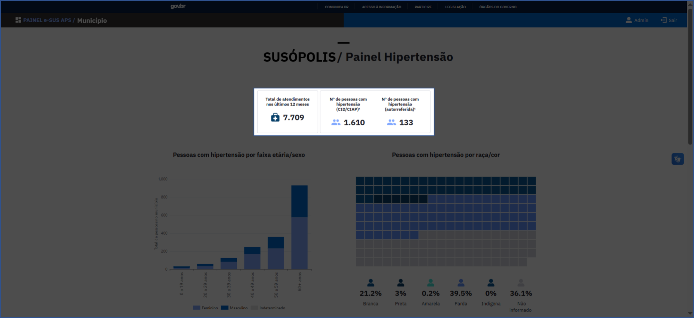
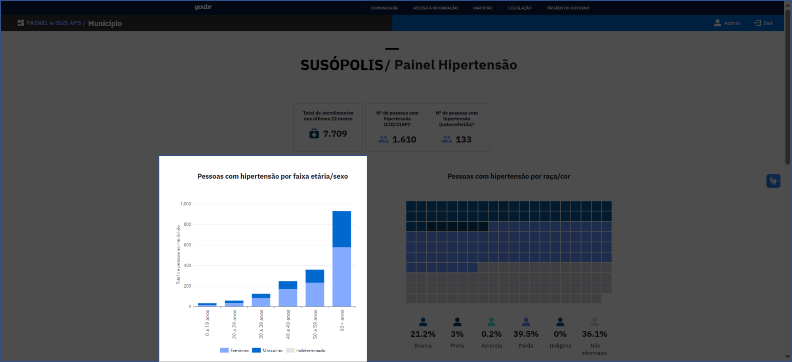
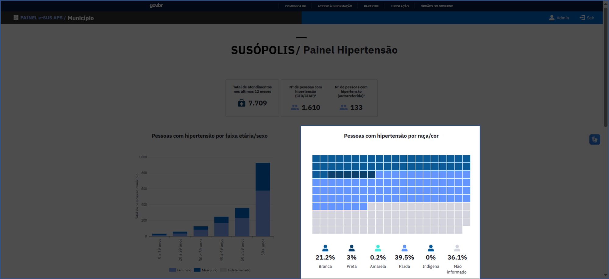
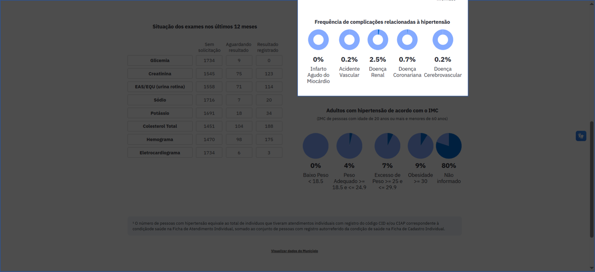
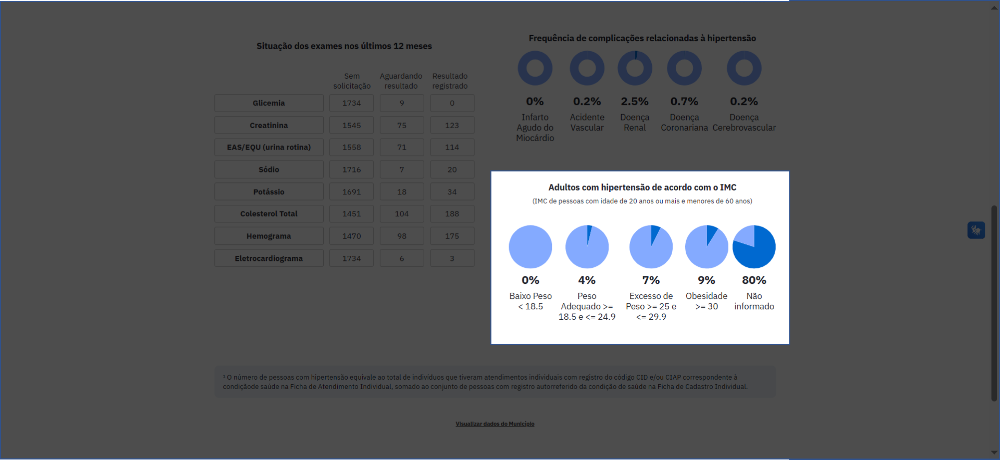
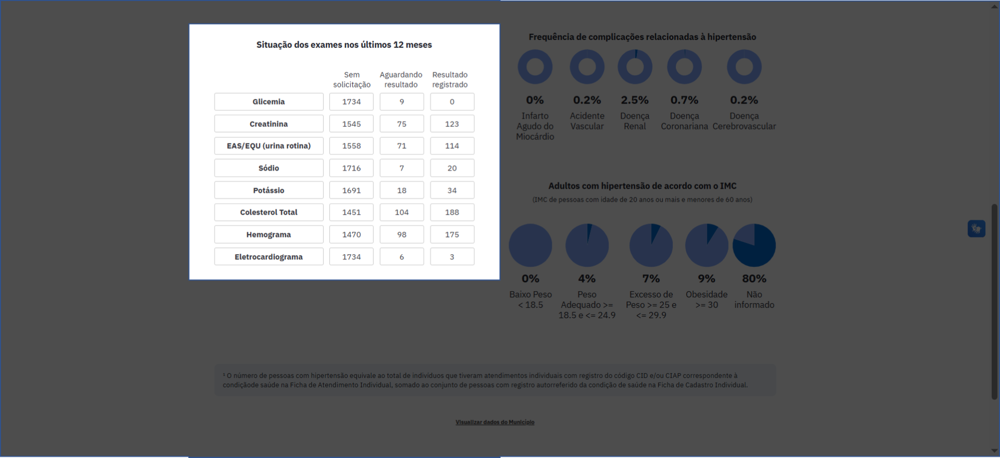
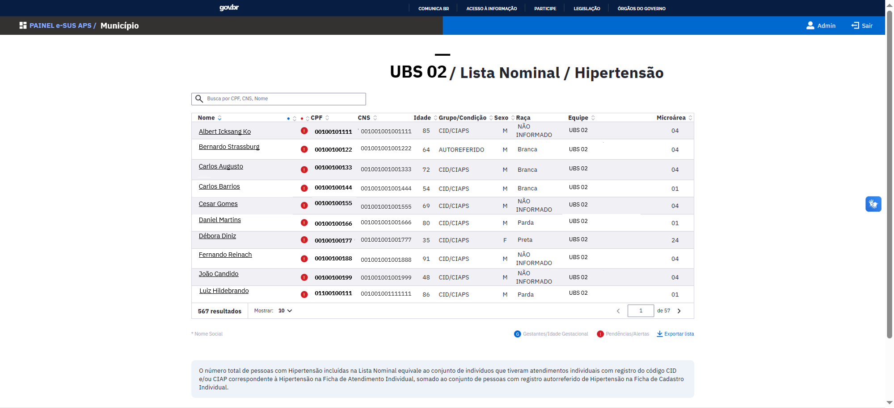
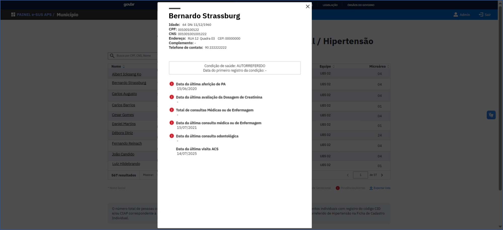

# Relatório Temático de Hipertensão

Este Relatório Temático se refere às informações de cuidado da pessoa com Hipertensão Arterial na Atenção Primária à Saúde, e os valores apresentados estarão sempre relacionados ao nível de visualização escolhido previamente: Município, Unidade Básica de Saúde (UBS) ou Equipe, ou seja, se uma UBS é selecionada para visualização, todos os totais e percentuais vão se referir à população acompanhada por esta UBS.

## Fontes de dados

Os dados do Relatório do tema **pessoas com hipertensão** são provenientes das seguintes fichas:

- **Ficha de Cadastro Individual** (captando diagnósticos autorreferidos)
- **Ficha de Atendimento Individual**
- **Ficha de Atendimento Odontológico**
- **Ficha de Cadastro Domiciliar e Territorial**
- **Ficha de Visita Domiciliar e Territorial**

Além de informações da [Tabela de Acompanhamento de Cidadãos Vinculados](https://integracao.esusab.ufsc.br/dw/visualizacoes/acompanhamento_cidadaos_vinculados.html).

O número de **pessoas com Hipertensão Arterial** equivale ao total de indivíduos que realizaram atendimentos com registro do código CID-10, CIAP-2 ou ABP correspondentes à condição de saúde, presentes na **Ficha de Atendimento Individual**, somado ao conjunto de pessoas com registro autorreferido da condição de saúde na **Ficha de Cadastro Individual**.

## Total de atendimentos e pessoas com hipertensão

Nos quadros destacados nas ilustrações abaixo, temos o **total de atendimentos nos últimos 12 meses** de pessoas com hipertensão, bem como o número de pessoas com hipertensão identificadas através dos códigos **CID-10/CIAP-2/ABP**, e os casos **autorreferidos**.

*Total de atendimentos e pessoas com hipertensão*

O **número de pessoas com hipertensão (CID-10/CIAP-2/ABP)** equivale aos indivíduos que tiveram atendimentos individuais realizados nos últimos 12 meses com registro do código CID-10, CIAP-2 ou ABP correspondente à condição de saúde na Ficha de Atendimento Individual.

O **número de pessoas com hipertensão (autorreferida)** refere-se aos indivíduos que declararam ter a condição de saúde na Ficha de Cadastro Individual e que não receberam o diagnóstico da condição em registro de Atendimento Individual por meio de código CID-10, CIAP-2 ou ABP.

## Pessoas com hipertensão por faixa etária/sexo

O **total de pessoas com hipertensão** por **faixa etária** e por **sexo**, são apresentados através do gráfico ilustrado a seguir. O total de pessoas por sexo pode ser visualizado quando o(a) usuário(a) posicionar o cursor em cada parte do gráfico.

*Pessoas com hipertensão por faixa etária e sexo*

## Pessoas com hipertensão por raça/cor

O **total de pessoas** com hipertensão e suas proporções por categorias de **raça/cor** são apresentados no gráfico abaixo. A quantidade de indivíduos de cada categoria pode ser visualizada ao posicionar o cursor sobre as respectivas áreas do gráfico.

*Pessoas com hipertensão por raça/cor*

## Frequência de complicações relacionadas à hipertensão

A frequência é ilustrada através de gráficos que especificam as porcentagens das seguintes complicações relacionadas à hipertensão:

- **Infarto agudo do miocárdio**
- **Acidente vascular**
- **Doença renal**
- **Doença coronariana**
- **Doença cerebrovascular**

*Frequência de complicações relacionadas à hipertensão*

## Adultos com hipertensão de acordo com o IMC

A quantidade de **adultos (20 a 59 anos de idade) com hipertensão de acordo com o IMC (Índice de Massa Corporal)** é ilustrada através de gráficos que representam o percentual dos adultos com hipertensão em cada uma das categorias de classificação, baseadas nas faixas de valores de IMC:

| Classificação | Faixa de IMC |
|---------------|--------------|
| Baixo peso | IMC menor que 18,5 |
| Peso adequado | IMC entre 18,5 e 24,9 |
| Excesso de peso | IMC entre 25 e 29,9 |
| Obesidade | IMC maior ou igual a 30 |
| Não informado | Informação de peso e altura não disponível |

O IMC é calculado utilizando-se o último registro simultâneo de peso e altura. O número das pessoas com hipertensão compreendidas em cada classificação pode ser visualizado quando o(a) usuário(a) posicionar o cursor em cada parte do gráfico.

*Adultos com hipertensão de acordo com o IMC*

## Situação dos exames nos últimos 12 meses

Para avaliar a **situação dos exames nos últimos 12 meses** temos as indicações de quantidade de exames:

- **Sem solicitação**
- **Aguardando resultado**
- **Resultado registrado**

Para o total de pessoas com diabetes, por tipo de exame:

- Glicemia
- Creatinina
- EAS/EQU (urina rotina)
- Sódio
- Potássio
- Colesterol total
- Hemograma
- Eletrocardiograma

*Situação dos exames nos últimos 12 meses*

## Lista nominal das pessoas com hipertensão

Ao final da página do RT de Hipertensão, na visualização por UBS ou equipe, há um botão clicável "Ver lista nominal", que dá acesso à lista.

A **lista nominal** contém o número total de pessoas com hipertensão (identificadas por CID-10/CIAP-2/ABP ou autorreferidas, conforme definição de pessoa com hipertensão) pela UBS ou equipe selecionada para visualização.

A lista possui as respectivas informações de cada pessoa:

- **Nome**
- **CPF**
- **Cartão Nacional de Saúde (CNS)**
- **Idade**
- **Grupo/Condição**
- **Sexo**
- **Raça**
- **Equipe**
- **Microárea**

É possível realizar a busca por informações de cada cidadão através do número do CPF, CNS ou Nome, na janela de busca presente na parte superior da lista nominal.

:::warning Alerta
O símbolo de **Alerta**, em vermelho, ao lado do nome do cidadão, indica situações que requerem atenção especial, por não estarem de acordo com as boas práticas preconizadas para o acompanhamento de saúde de pessoas com hipertensão.
:::

*Lista nominal das pessoas com hipertensão*

### Detalhamento do cidadão

Ao clicar no nome do cidadão na lista nominal é possível visualizar, além dos dados pessoais do cidadão, informações adicionais, quando disponíveis, como:

- **Data da última aferição de PA** (pressão arterial)
- **Data da última avaliação da dosagem de creatinina**
- **Total de consultas médicas ou de enfermagem**
- **Data da última consulta médica ou de enfermagem**
- **Data da última consulta odontológica**
- **Data da última visita do ACS** (Agente Comunitário de Saúde)

*Card de detalhamento da pessoa e dos alertas*

