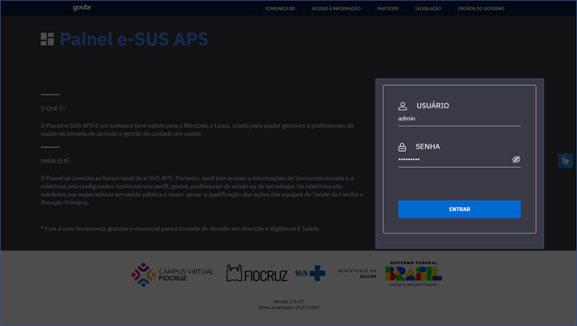
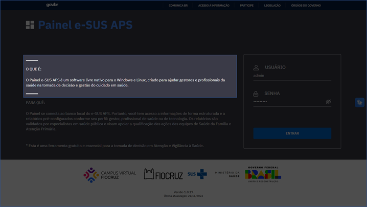
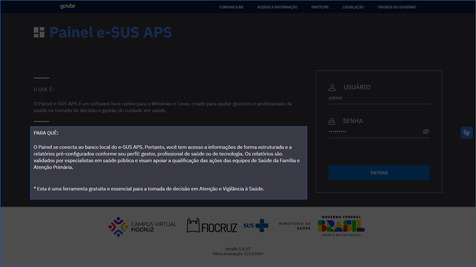
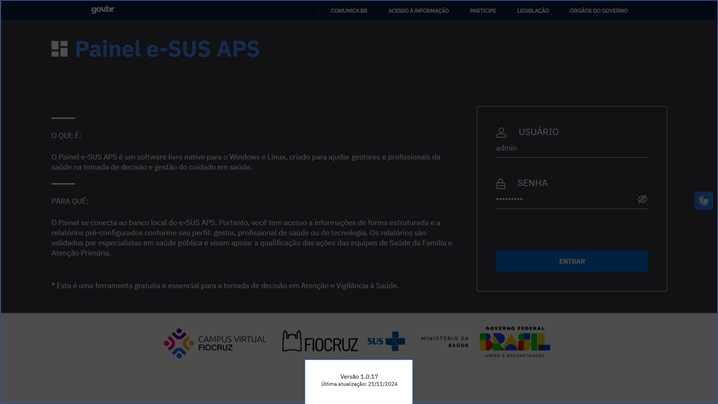
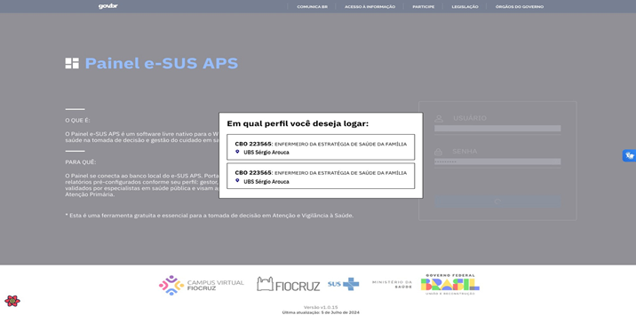

# Manual de Uso - Painel e-SUS APS

## Apresentação

O e-SUS APS é uma iniciativa da Secretaria de Atenção Primária (Saps) que visa reestruturar as informações da Atenção Primária à Saúde (APS) em todo o país. Esta ação está alinhada com a proposta mais ampla de reestruturação dos Sistemas de Informação em Saúde (SIS) do Ministério da Saúde (MS), reconhecendo que a qualificação da gestão da informação é essencial para melhorar a qualidade do atendimento à população.

A Estratégia e-SUS APS refere-se ao processo de informatização qualificada do Sistema Único de Saúde (SUS), buscando a implementação de um SUS eletrônico (e-SUS). O objetivo é estabelecer um novo modelo de gestão da informação que apoie os municípios e os serviços de saúde na gestão eficaz da APS e na qualificação do cuidado aos usuários.

Nesse contexto, o Painel e-SUS APS surge como uma ferramenta estratégica para aprimorar a gestão da informação, da clínica e do cuidado na APS em nível municipal. Trata-se de um software aberto, integrado diretamente à base de dados local do sistema e-SUS APS. O Painel e-SUS APS oferece uma visão abrangente dos dados populacionais e de saúde, permitindo às equipes de saúde e gestores uma compreensão clara e atualizada da situação de saúde do território. Além disso, possibilita o acompanhamento longitudinal e integrado dos cidadãos adscritos, facilitando uma atenção mais coordenada e centrada no usuário.

Mais do que apenas fornecer informações, o Painel e-SUS APS contribui diretamente para a melhoria dos processos de monitoramento e tomada de decisão, permitindo que gestores e profissionais de saúde ajustem e otimizem suas estratégias com base em dados concretos, resultando em intervenções mais precisas e oportunas. Diante disso, este Manual tem como objetivo detalhar os relatórios que compõem o Painel e-SUS APS, explicando cada componente dos relatórios temáticos.

## Visualização em três níveis

Os relatórios são apresentados em três níveis de visualização: **Município**, **Unidade Básica de Saúde (UBS)** e **Equipe**.

Os diferentes níveis de visualização apresentados no Painel dialogam com o conceito de território. A concepção mais comum de território é a de um espaço geográfico delimitado por divisões administrativas, que podem dar origem a bairros, cidades, estados e países.

Nesta aplicação do Painel e-SUS APS:

- A **visualização por Município** oferece uma visão geral, sendo útil principalmente para o gestor de saúde municipal, que poderá identificar o cenário atual do município
- A **visualização por Unidade Básica de Saúde** detalha o território de abrangência da UBS, auxiliando majoritariamente tanto o gestor de saúde municipal quanto o gestor da própria UBS
- A **visualização por Equipe** tem como principal objetivo apresentar o cenário da população acompanhada pela equipe

## Acesso ao Painel e-SUS APS

O acesso ao Painel e-SUS APS é realizado através do link fornecido pelo município. Ao abrir a aplicação, terá o direcionamento para a tela de login. O acesso do administrador do Painel e-SUS APS é configurado durante a instalação inicial, e os profissionais de saúde utilizarão as mesmas credenciais (login e senha) do PEC e-SUS APS, sendo assim:

- No campo **usuário**, deve-se inserir o CPF do usuário
- No campo **senha**, digitar a senha correspondente, a mesma utilizada no PEC

*Formulário de login do Painel e-SUS APS*

Nesta página também são encontradas informações gerais sobre o Painel e-SUS APS e sua função, conforme ilustrado a seguir.

*Texto informativo sobre o Painel e-SUS APS*

*Texto informativo sobre o Painel e-SUS APS*

A versão atual e a data da última atualização do Painel e-SUS APS estão disponíveis ao fim de todas as páginas do Painel e-SUS APS.

*Versão Painel e-SUS APS*

Caso o(a) usuário(a) do Painel e-SUS APS possua mais de um CBO cadastrado na autenticação do PEC, poderá escolher o perfil que deseja utilizar para o acesso, a exemplo da ilustração a seguir.

*Lista de perfil ativos dos profissionais de saúde*

