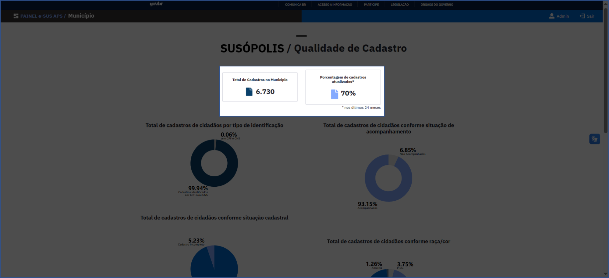
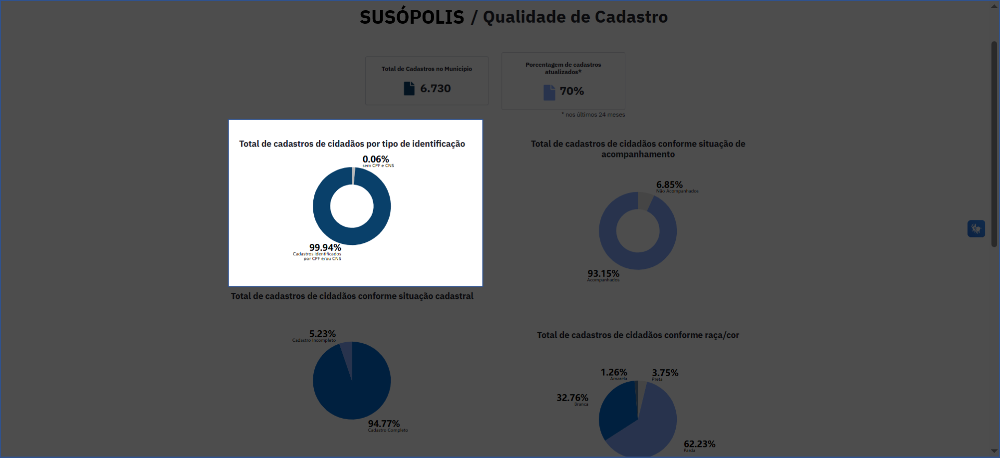
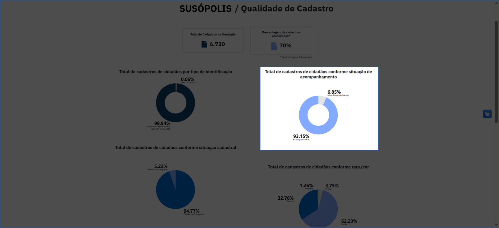
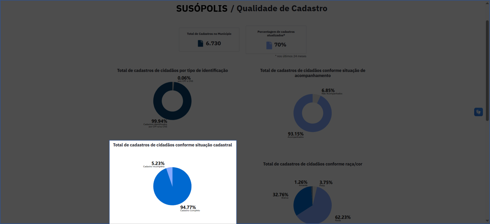
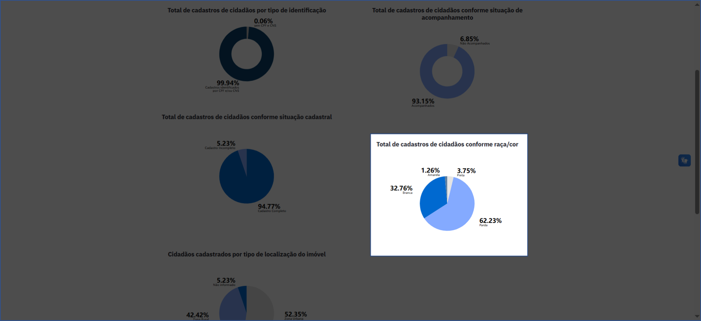
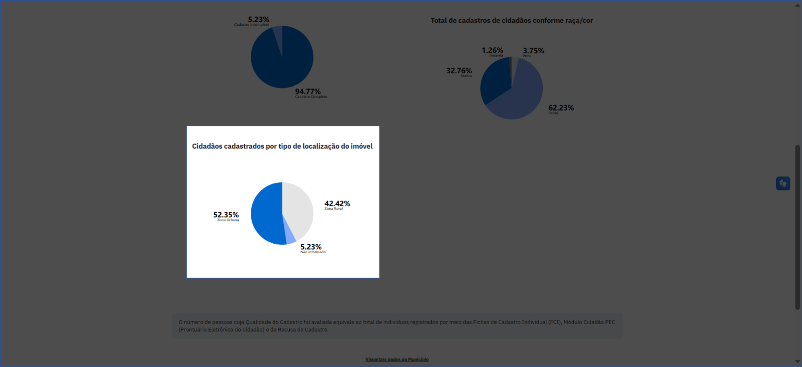
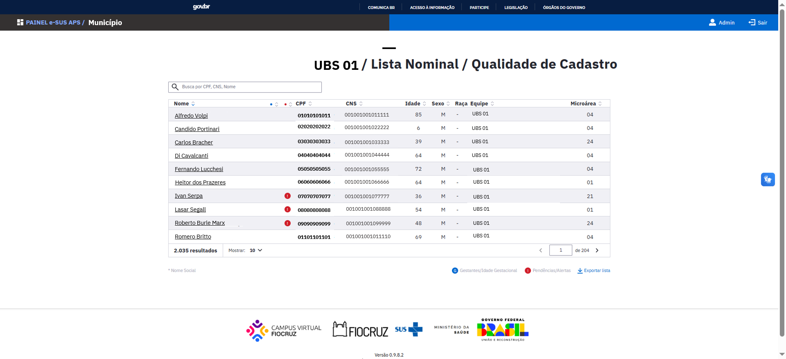
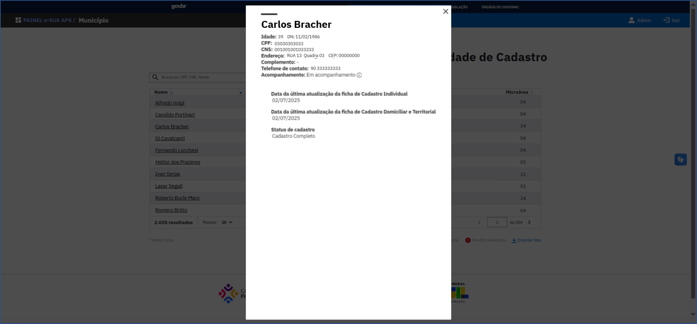

# Relatório Temático de Qualidade de Cadastro

Este Relatório Temático apresenta informações sobre o total de pessoas com cadastro ativo na **Ficha de Cadastro Individual** — ou seja, sem registro de óbito ou mudança de território na última atualização — vinculados a uma equipe de saúde da família do município. Além de informações de localização de moradia da **Ficha de Cadastro Domiciliar e Territorial**, consolidadas na [Tabela de Acompanhamento de Cidadãos Vinculados](https://integracao.esusab.ufsc.br/dw/visualizacoes/acompanhamento_cidadaos_vinculados.html).

Os valores apresentados estarão sempre relacionados ao nível de visualização escolhido previamente: Município, Unidade Básica de Saúde (UBS) ou Equipe, ou seja, se uma UBS é selecionada para visualização, todos os totais e percentuais vão se referir à população acompanhada por esta UBS.

## Total de cadastros e proporção de cadastros atualizados

O **total de cadastros** e a **porcentagem de cadastros atualizados** nos últimos 24 meses são apresentados conforme ilustrado no exemplo a seguir. O número de pessoas cuja qualidade do cadastro foi avaliada equivale ao total de indivíduos que possuem cadastro ativo na Atenção Primária.

*Total de cadastros e a porcentagem de cadastros atualizados nos últimos 24 meses*

## Total de cadastros de cidadãos por tipo de identificação

O percentual de cadastros por **tipo de identificação**, é apresentado no gráfico conforme a ilustração abaixo, e representa os cadastros realizados **com preenchimento do CPF e/ou CNS do cidadão**, ou **sem o preenchimento de CPF e CNS**.

*Total de cadastros de cidadãos por tipo de identificação*

## Total de cadastros de cidadãos conforme situação de acompanhamento

O percentual de cadastros, segundo **situação de acompanhamento**, é apresentado no gráfico abaixo, e representa os cadastros que tiveram algum atendimento ou procedimento realizado nos últimos 12 meses, conforme situação: **acompanhados** e **não acompanhados**.

:::info Critério de acompanhamento
Para fins deste indicador, a população será considerada acompanhada quando apresentar mais de um contato com profissional de saúde no período de um ano, sendo necessário que pelo menos um desses contatos seja um atendimento, podendo ser individual, coletivo e/ou domiciliar.
:::

*Total de cadastros de cidadãos conforme situação de acompanhamento*

## Total de cadastros de cidadãos conforme situação cadastral

O total de cadastros conforme situação cadastral, demonstrado no gráfico abaixo, apresenta a distribuição percentual entre cadastro completo e cadastro incompleto. O cadastro é considerado completo quando o cidadão possui ficha de cadastro individual e ficha de cadastro domiciliar e territorial.

*Total de cadastros de cidadãos conforme situação cadastral*

## Total de cadastros de cidadãos conforme raça/cor

A distribuição percentual dos cidadãos cadastrados segundo categorias de **raça/cor** (Branca; Preta; Amarela; Parda; Indígena; e Não informado) é apresentada no painel e ao posicionar o cursor no gráfico indicado na imagem abaixo, é possível verificar os totais em cada categoria, de acordo com a visualização escolhida.

*Total de cadastros de cidadãos conforme raça/cor*

## Cidadãos cadastrados por tipo de localização do imóvel

O total de cidadãos cadastrados e o percentual por **localização dos imóveis cadastrados** são informações provenientes da **Ficha de Cadastro Domiciliar e Territorial** e ilustradas através do gráfico com os seguintes tipos de localização:

- **Zona urbana**
- **Zona rural**
- **Não informado** (caso a informação não esteja disponível)

O total das pessoas em cada classificação pode ser visualizada quando o(a) usuário(a) posicionar o cursor em cada parte do gráfico.

*Localização dos domicílios cadastrados*

## Lista nominal dos cidadãos cadastrados

Ao final da página do RT de Qualidade de Cadastro, há um botão clicável "Ver lista nominal", que permite acessar a lista correspondente.

A **lista nominal** contém o número total de **pessoas cadastradas** e apresenta as seguintes informações de cada pessoa:

- **Nome**
- **CPF**
- **Cartão Nacional de Saúde (CNS)**
- **Idade**
- **Sexo**
- **Raça**
- **Equipe**
- **Microárea**

Ela também permite realizar buscas específicas por cidadão utilizando o número do CPF, CNS ou pelo nome, conforme demonstrado na ilustração abaixo.

:::warning Alerta
O símbolo de **Alerta**, em vermelho, indica situações que requerem atenção especial relacionadas à situação cadastral da pessoa.
:::

*Lista Nominal de Qualidade de Cadastro*

### Detalhamento do cidadão

Ao clicar no nome do cidadão na lista nominal é possível visualizar, além dos dados pessoais do cidadão, informações adicionais, quando disponíveis, como:

- **Data da última atualização da Ficha de Cadastro Individual**
- **Data da última atualização da ficha de Cadastro Domiciliar e Territorial**
- **Status do cadastro** (completo ou incompleto)

*Card de detalhamento da pessoa e dos alertas*

