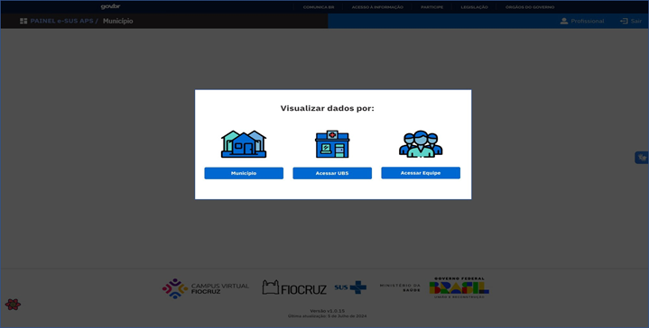
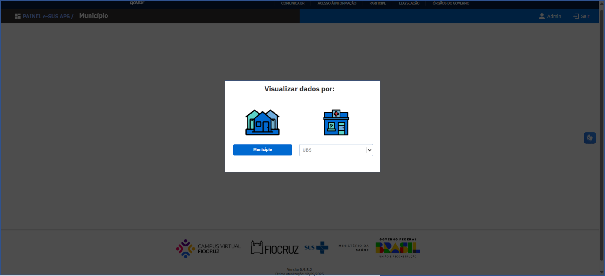
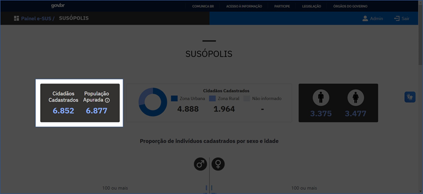
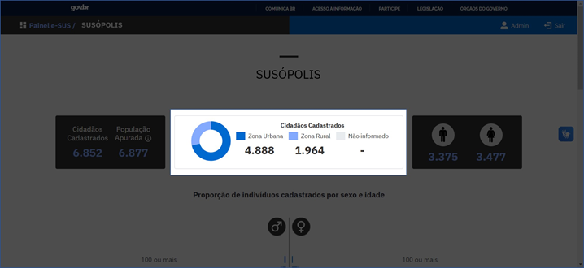
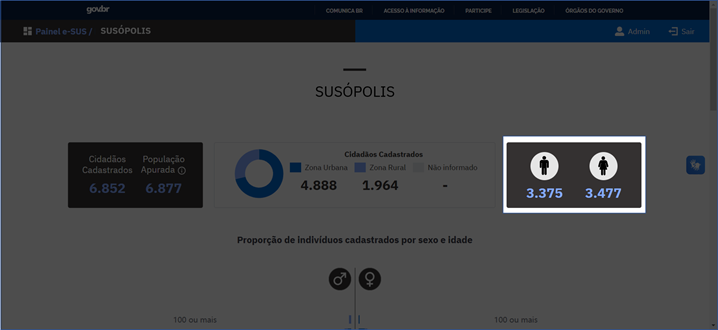
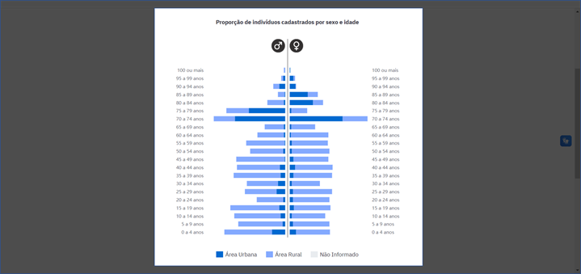

# Relatório Sociodemográfico

Após realizar o login, será possível optar por níveis de visualização das informações, considerando o perfil de lotação: **Município**, **Unidade Básica de Saúde (UBS)** ou **Equipe**.

O Relatório Sociodemográfico conterá, portanto, o conjunto de informações sobre os cidadãos vinculados de acordo com o nível de visualização da informação escolhida. O nível de Município é o mais amplo do ponto de vista de granularidade, e contém as informações do respectivo município e suas respectivas UBS. O nível de UBS, por sua vez, contém informações da própria UBS e de todas as equipes adscritas. A visualização por Equipe representa o nível mais detalhado de informação disponível no relatório.

*Níveis de visualização dos dados*

No relatório, são encontradas as informações a respeito da população apurada e dos cidadãos cadastrados com as estratificações por sexo, localização de moradia e faixa etária, ilustradas abaixo e detalhadas a seguir.

*Cidadãos Cadastrados e População Apurada*

## Cidadãos Cadastrados

Esta informação é extraída da [Tabela de Acompanhamento de Cidadãos Vinculados](https://integracao.esusab.ufsc.br/dw/visualizacoes/acompanhamento_cidadaos_vinculados.html), no qual são consideradas as **Fichas de Cadastro Individual (FCI)** e o **Cadastro Simplificado do Cidadão**. Complementarmente, são utilizados os dados da **Ficha de Cadastro Domiciliar e Territorial (FCDT)** para composição de informação de endereço, microárea e estrutura do núcleo familiar. São considerados cidadãos cadastrados aqueles com cadastro ativo, ou seja, sem registro de óbito ou mudança de território na última atualização, vinculados a uma equipe de saúde da família e/ou a uma unidade de saúde do município.

## População Apurada

**População Apurada** é a estimativa da população do município para o ano de 2023, realizada pelo IBGE, projetada a partir dos dados do Censo Demográfico. Essa informação foi extraída da Relação da População Municipal enviada ao TCU em 2023, pelo IBGE. A exibição da População Apurada será apresentada apenas se, durante a instalação do Painel e-SUS APS, o código IBGE completo do município (7 dígitos) tiver sido informado durante a configuração inicial, sendo mantida na visualização por Município, Unidade Básica de Saúde e Equipe.

## Tipo de localização de moradia

Esse dado é extraído da [Tabela de Acompanhamento de Cidadãos Vinculados](https://integracao.esusab.ufsc.br/dw/visualizacoes/acompanhamento_cidadaos_vinculados.html), tendo como fonte de origem a **Ficha de Cadastro Domiciliar e Territorial (FCDT)**. Os números representam todas as pessoas com cadastro ativo nas Unidades Básicas de Saúde do Município, estratificadas por **Zona Urbana** e **Zona Rural**. Pessoas que só possuem associação a uma FCI e não possuem associação com FCDT, são indicadas como **Não Informado**.

A distribuição dos cidadãos cadastrados por tipo de localização é visualizada através de um gráfico de rosca, conforme ilustrado a seguir, e o total de pessoas em cada tipo de localização pode ser visualizado quando o(a) usuário(a) posicionar o cursor em cada parte do gráfico.

*Tipo de localização de moradia*

## Cidadãos cadastrados por sexo

A informação é proveniente da [Tabela de Acompanhamento de Cidadãos Vinculados](https://integracao.esusab.ufsc.br/dw/visualizacoes/acompanhamento_cidadaos_vinculados.html) e são todas as pessoas com cadastro ativo, estratificadas por sexo **masculino** ou **feminino**.

A visualização é identificada no Painel e-SUS APS pelos respectivos símbolos e pelo total de pessoas por sexo, de acordo com o nível de visualização escolhido.

*Cidadãos cadastrados por sexo*

## Proporção de indivíduos cadastrados por sexo e idade

São todas as pessoas com cadastro ativo que estão na [Tabela de Acompanhamento de Cidadãos Vinculados](https://integracao.esusab.ufsc.br/dw/visualizacoes/acompanhamento_cidadaos_vinculados.html), de acordo com o nível de visualização escolhido, estratificadas por **faixa etária** e por sexo (**masculino** ou **feminino**). Para as pessoas que possuem **Ficha de Cadastro Domiciliar e Territorial (FCDT)**, também é demonstrada a localização do domicílio como **Zona Urbana** ou **Zona Rural**.

As proporções estão representadas no gráfico de pirâmide etária a seguir e o total de pessoas em cada tipo de localização pode ser visualizado quando o(a) usuário(a) posicionar o cursor sobre as respectivas áreas do gráfico.

*Pirâmide etária estratificada por sexo e faixa etária*

