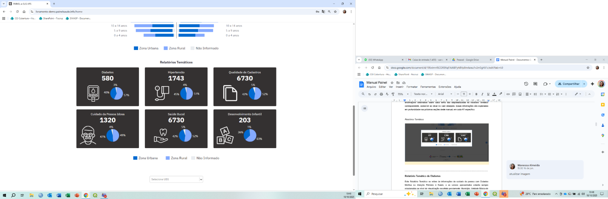

# Relatórios Temáticos

Os Relatórios Temáticos (RT) apresentam informações sobre as pessoas cadastradas de acordo com o nível de visualização selecionado, organizadas nos seguintes temas:

- **Diabetes**
- **Hipertensão**
- **Qualidade de Cadastro**
- **Cuidado da Pessoa Idosa**
- **Saúde Bucal**
- **Desenvolvimento Infantil**

Os RT são apresentados por meio de cards clicáveis, que exibem o **número absoluto de pessoas relacionadas a cada tema**, e de gráficos que mostram o percentual de pessoas de cada relatório por **tipo de localização**. A identificação da localização de moradia segue a mesma metodologia utilizada no Relatório Sociodemográfico. Para visualizar o total de pessoas em cada tipo de localização, basta posicionar o cursor sobre as áreas correspondentes do gráfico.

Informações detalhadas sobre cada tema são disponibilizadas no Relatório Temático correspondente, acessível ao clicar no card desejado. Essas informações são exploradas em profundidade nas próximas seções deste manual, em cada RT específico.

*Relatórios Temáticos*

