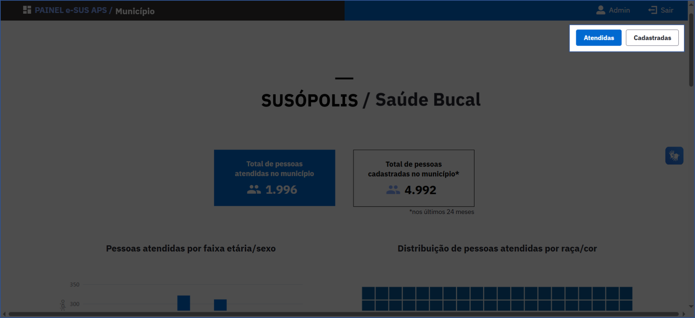
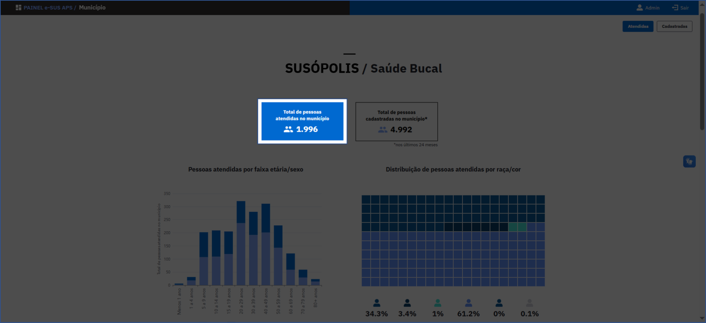
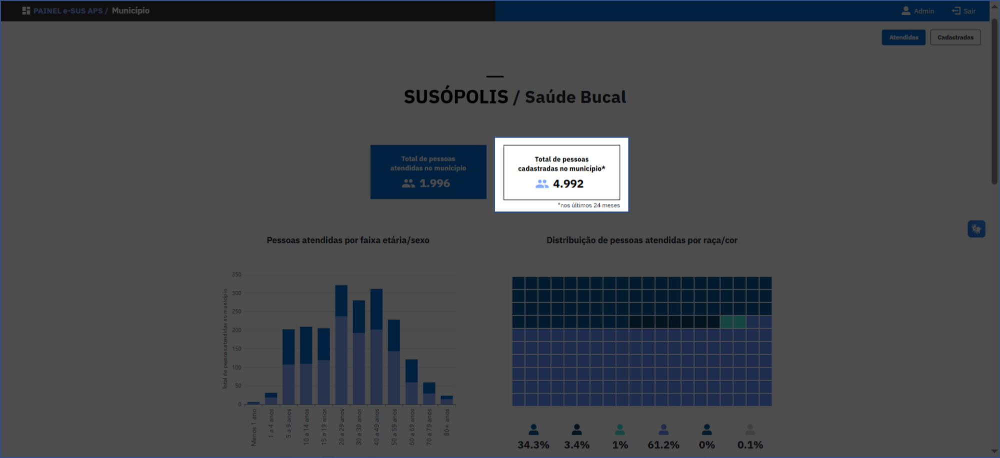
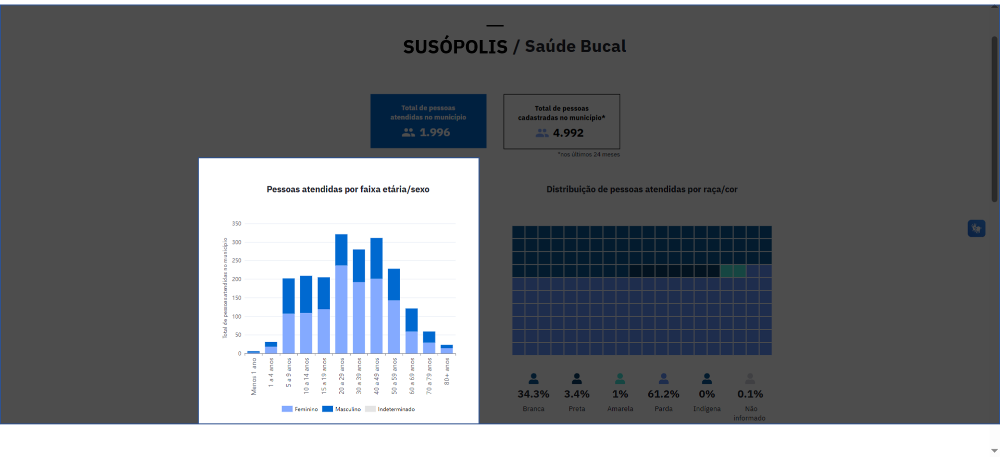
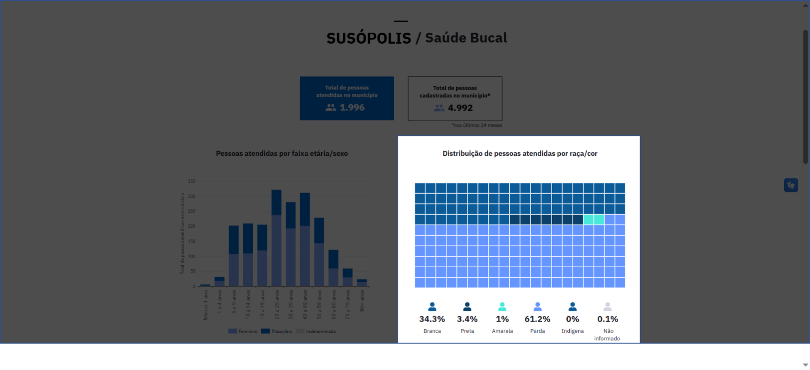
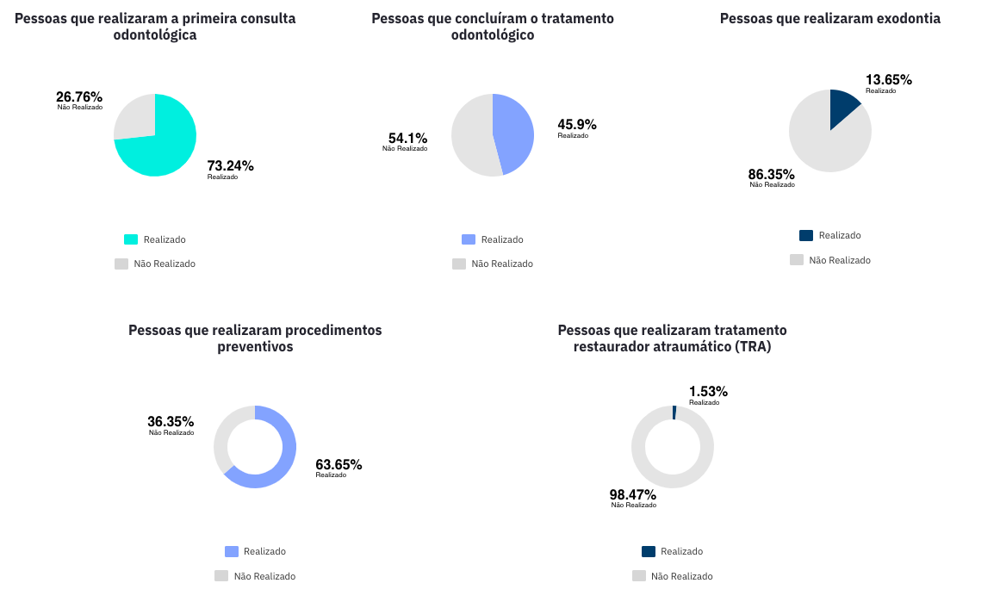
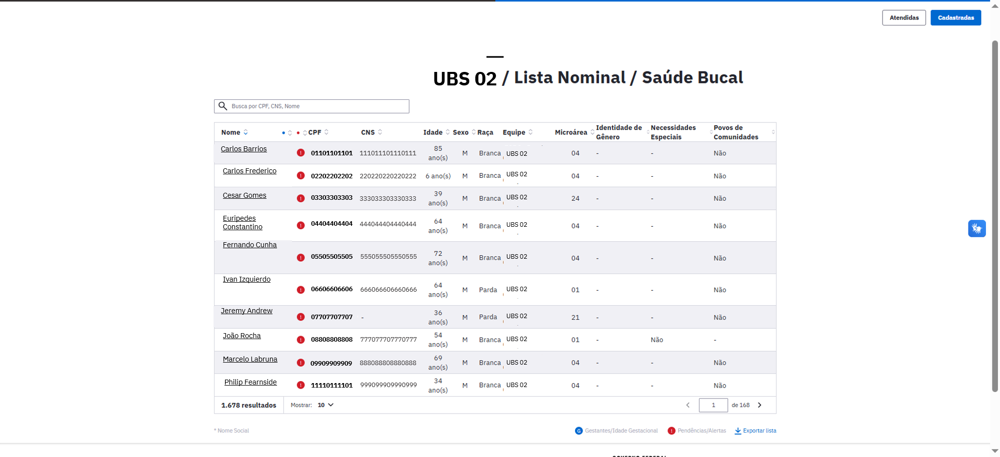
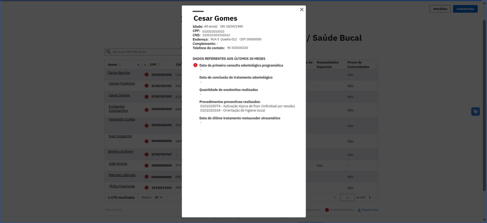

# Relatório Temático de Saúde Bucal

O Relatório Temático de Saúde Bucal apresenta informações relacionadas à saúde bucal dos cidadãos cadastrados na Atenção Primária e vinculados à uma equipe de saúde da família do município sob dois conceitos: o primeiro entre a **população atendida**, e separadamente, entre a **população cadastrada**. Os valores apresentados estarão sempre relacionados ao nível de visualização escolhido previamente: Município, Unidade Básica de Saúde (UBS) ou Equipe, como nos demais relatórios.

## Fontes de dados

Os dados do relatório são provenientes das seguintes fichas:

- **Ficha de Cadastro Individual**
- **Ficha de Atendimento Odontológico**

Além de informações da [Tabela de Acompanhamento de Cidadãos Vinculados](https://integracao.esusab.ufsc.br/dw/visualizacoes/acompanhamento_cidadaos_vinculados.html).

Existe a possibilidade de escolher qual população o usuário quer visualizar (atendida ou cadastrada) clicando na área indicada na imagem a seguir:

*Atendidas e cadastradas*

## Total de pessoas atendidas

A **População Atendida** se refere à todas as pessoas vinculadas à uma equipe que tenham realizado algum atendimento odontológico nos últimos 2 anos. Para fins deste relatório serão considerados todos os atendimentos odontológicos da pessoa, ainda que tenham sido realizados em outra Unidade de Saúde, conforme a regra de cálculo preconizada.

:::note
Não serão incluídas na População Atendida as pessoas que realizaram atendimento odontológico, porém, não possuem Ficha de Cadastro Individual.
:::

O **total de cidadãos atendidos** é apresentado no card no topo da página do relatório, conforme imagem a seguir:

*Total de pessoas atendidas no município*

## Total de pessoas cadastradas

A **População Cadastrada** se refere à todas as pessoas vinculadas à uma equipe que tenham a Ficha de Cadastro Individual atualizada nos últimos 2 anos. Para fins deste relatório serão considerados todos os atendimentos odontológicos da pessoa, ainda que tenham sido realizados em outra Unidade de Saúde, conforme a regra de cálculo preconizada.

O **total de cidadãos cadastrados** é apresentado no topo da página do relatório, conforme imagem a seguir:

*Total de pessoas cadastradas no município*

## Pessoas atendidas ou cadastradas por faixa etária/sexo

O **total de pessoas atendidas ou cadastradas** distribuídas segundo o sexo (Masculino e Feminino), nas suas respectivas faixas de idade é observado no gráfico abaixo. Ao posicionar o cursor nas cores das barras, é possivel verificar os totais de pessoas por sexo.

*Pessoas atendidas por faixa etária/sexo*

## Distribuição das pessoas atendidas ou cadastradas por raça/cor

O gráfico abaixo ilustra o **total de pessoas atendidas ou cadastradas** distribuídas segundo a raça/cor (Branca; Preta; Amarela; Parda; Indígena; e Não informado). Ao posicionar o cursor nas cores do gráfico, é possível verificar os totais de pessoas em cada categoria.

*Distribuição das pessoas atendidas por raça/cor*

## Indicadores de Saúde Bucal

A imagem abaixo apresenta **cinco gráficos de pizza**, cada um ilustrando a **distribuição percentual das pessoas atendidas ou cadastradas** para indicadores relacionados às boas práticas de Saúde Bucal realizadas nos últimos 24 meses:

1. **Proporção de pessoas que realizaram a primeira consulta odontológica**
2. **Proporção de pessoas que concluíram o tratamento odontológico**
3. **Proporção de pessoas que realizaram exodontia**
4. **Proporção de pessoas que realizaram procedimentos preventivos**
5. **Proporção de pessoas que realizaram tratamento restaurador atraumático (TRA)**

As legendas abaixo de cada gráfico especificam as cores correspondentes às categorias **"Realizado"** e **"Não Realizado"**.

*Indicadores de saúde bucal referentes à população atendida ou cadastrada*

## Lista nominal de saúde bucal (população atendida ou cadastrada)

Ao final da página do relatório, há um botão clicável "Ver lista nominal", que permite acessar a lista correspondente.

A lista nominal contém o total de pessoas atendidas ou cadastradas, dependendo da população escolhida, vinculadas à UBS ou à equipe selecionada para visualização.

A lista apresenta as seguintes informações de cada pessoa:

- **Nome**
- **CPF**
- **Cartão Nacional de Saúde (CNS)**
- **Idade**
- **Sexo**
- **Raça**
- **Equipe**
- **Microárea**
- **Identidade de gênero**
- **Indicação de pessoa com necessidades especiais**
- **Indicação se a pessoa pertence à comunidade tradicional**

Ela também permite realizar buscas específicas por cidadão utilizando o número do CPF, CNS ou pelo nome, conforme demonstrado na ilustração abaixo.

:::warning Alerta
O símbolo de **Alerta**, em vermelho, indica situações que requerem atenção especial relacionadas à situação cadastral da pessoa.
:::

:::info Gestante
O símbolo com um **G**, em azul, indica uma mulher que estava gestante no momento do seu último atendimento odontológico.
:::

*Lista nominal da saúde bucal*

### Detalhamento do cidadão

Ao clicar no nome do cidadão na lista nominal é possível visualizar, além dos dados pessoais do cidadão, informações adicionais, quando disponíveis, como:

- **Data da primeira consulta odontológica programática**
- **Data da conclusão do tratamento**
- **Quantidade de exodontias realizadas**
- **Procedimentos preventivos realizados**
- **Data do último tratamento restaurador atraumático**

*Card de detalhamento da pessoa e dos alertas*

