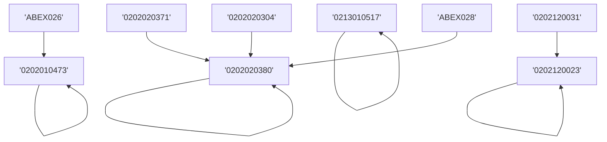
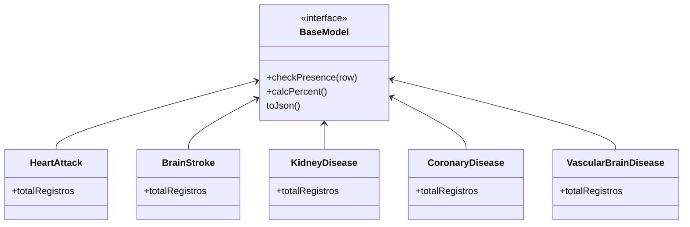
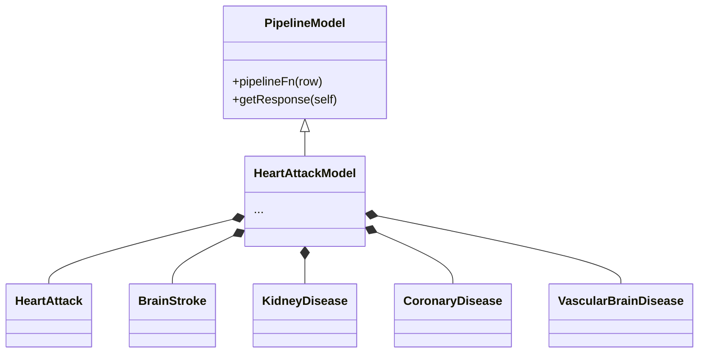
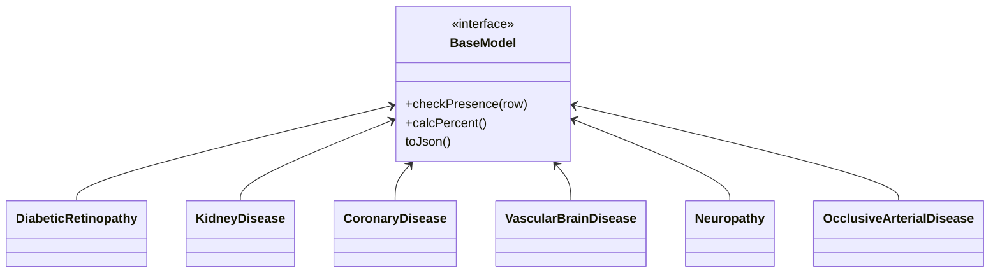
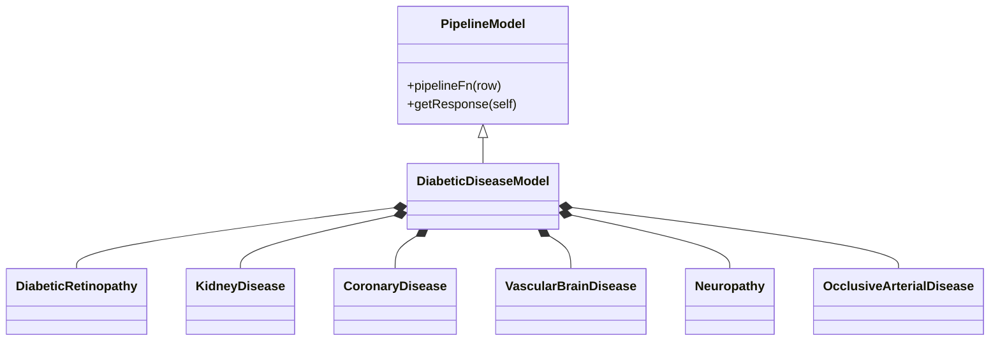

# Painel Saúde

## Requirements
- The requirements to run this project is listed as follow:
  - docker
  - docker-compose
  - python
  - pip

## TO RUN

- Create a Virtual env: `python -m venv painel`
- Activate virtual env: `source painel/bin/activate`
- `pip install -r requirements.txt`
- First some configurations must be setup on docker-compose.yml
```
...
  environment:
        - HOST=<HOST>
        - DATABASE=<DATA BASE>
        - USER=<DATABASE USER>
        - PASSWORD=<DATABASE PASSWORD>
        - PORT=<DATABASE PORT>
        - CIDADE=<CITY>
        - ESTADO=<STATE>
        - ADMIN_USR=<ADMIN USER>
        - ADMIN_PASS=<ADMIN PASSWORD>
...
```
- Run:
  `docker-compose up`


## Estrutura da Base

### CADASTRO MESTRE

| co_fat_cidadao_pec | co_dim_identidade_genero_CP | co_dim_tempo_nascimento | co_dim_sexo_CI | co_dim_unidade_saude_CI | co_dim_municipio_CI | co_dim_tempo | co_dim_identidade_genero_CI | dt_nascimento_CI    | co_dim_tempo_CI     | \_mergeA | co_seq_fat_cidadao_territorio | co_fat_familia_territorio | \_mergeB | co_fat_cad_domiciliar | \_mergeC | co_dim_tipo_localizacao | co_dim_municipio_CD | co_dim_tempo_CD     | \_merge | CO_DIM_IDENTIDADE_GENERO | CO_DIM_SEXO | DT_NASCIMENTO       |
| ------------------ | --------------------------- | ----------------------- | -------------- | ----------------------- | ------------------- | ------------ | --------------------------- | ------------------- | ------------------- | -------- | ----------------------------- | ------------------------- | -------- | --------------------- | -------- | ----------------------- | ------------------- | ------------------- | ------- | ------------------------ | ----------- | ------------------- |
| 48188              | 5                           | 1959-10-08 00:00:00     | 2.0            | 63                      | 980                 | 20200521     | 5.0                         | 1959-10-08 00:00:00 | 2020-05-21 00:00:00 | both     | 1756256                       | 658922                    | both     | 155123                | both     | 2                       | 980                 | 2020-06-22 00:00:00 | both    | 5.0                      | 2.0         | 1959-10-08 00:00:00 |

### CADASTRO MESTRE

| co_fat_cidadao_pec | co_unidade_saude | ds_tipo_localizacao | co_municipio | dt_atendimento             | nu_idade_gestacional       | nu_gestas_previas | st_vacinacao_em_dia | cad_proced_solicitados                          | cad_proced_avaliados                | cad_filtro_cids                 | cad_filtro_ciap                | st_hipertensao | st_diabetes | st_gestante | nu_cnes | ds_unidade_saude               | no_municipio | co_ibge | no_uf | sg_uf | ds_sexo  | dt_nascimento       | nu_idade | ds_faixa_etaria |
| ------------------ | ---------------- | ------------------- | ------------ | -------------------------- | -------------------------- | ----------------- | ------------------- | ----------------------------------------------- | ----------------------------------- | ------------------------------- | ------------------------------ | -------------- | ----------- | ----------- | ------- | ------------------------------ | ------------ | ------- | ----- | ----- | -------- | ------------------- | -------- | --------------- |
| 48188              | 63               | Urbano              | 980,980,980  | 20181106,20190729,20200821 | 30001231,30001231,30001231 | ,,                | 0,0,                | 20181106:\|0205020097\|,20190729:\|,20200821:\| | 20181106:\|,20190729:\|,20200821:\| | \|Z000\|,\|I10\|I528\|,\|Z000\| | \|ABP023\|,\|,\|,\|,\|P20\|,\| | TRUE           | FALSE       | FALSE       | 3652971 | UBSF EDICON RIBEIRO DOS SANTOS | IRECÊ        | 2914604 | BAHIA | BA    | Feminino | 1959-10-08 00:00:00 | 62       | Faixa 7         |

### GESTANTES

| co_fat_cidadao_pec | Chave   | dt_nascimento       | co_dim_tempo_dum    | N_gestacoes | co_dim_unidade_saude | co_dim_tempo        | ds_filtro_cids | ds_filtro_ciaps | ds_filtro_proced_avaliados | ds_filtro_proced_solicitados | st_vacinacao_em_dia | st_gravidez_planejada | consultas_6_prenatal | exames_para_sifilis_hiv | com_atendimento_odontologico_stricted | com_atendimento_odontologico_razoavel | com_atendimento_odontologico_amplo | idade | ds_faixa_etaria_gestante | nu_idade_gestacional | nu_idade_gestacional_trimestre | nu_cnes | no_unidade_saude                    | isContained_DIABETE | isContained_HIPERTENSAO |
| ------------------ | ------- | ------------------- | ------------------- | ----------- | -------------------- | ------------------- | -------------- | --------------- | -------------------------- | ---------------------------- | ------------------- | --------------------- | -------------------- | ----------------------- | ------------------------------------- | ------------------------------------- | ---------------------------------- | ----- | ------------------------ | -------------------- | ------------------------------ | ------- | ----------------------------------- | ------------------- | ----------------------- |
| 26163              | 26163_1 | 1981-12-04 00:00:00 | 2017-08-15 00:00:00 | 1           | 61                   | 2018-05-02 00:00:00 | \|O367\|       | \|\|            | \|\|                       | \|\|                         | 0                   | 0                     |                      |                         |                                       |                                       |                                    | 40    | Faixa 6                  | 37                   | 3º Trimestre                   | 3749878 | UBSF RAIMUNDO C SOMBRA PAULO FREIRE | FALSE               | FALSE                   |

### Hipertensao

| co_fat_cidadao_pec | co_dim_unidade_saude_1 | co_dim_equipe_1 | co_dim_tempo                                 | dt_nascimento                                          | nu_peso          | nu_altura | co_seq_dim_cbo      | ds_filtro_cids                     | ds_filtro_ciaps                                                          | ds_filtro_proced_avaliados | ds_filtro_proced_solicitados                                                                                           | co_unidade_saude         | ds_tipo_localizacao                | ds_sexo                                      | nu_idade                 | nu_cbo                             | FAIXA_ETARIA_HIPERTENSO                 | ds_agravo_FINAL_NOM      | ds_agravo_FINAL_COD      | CBO_PROFISSIONAL                                | nu_peso_last | nu_altura_last | nu_altura_last_M | IMC IMC_FINAL |
| ------------------ | ---------------------- | --------------- | -------------------------------------------- | ------------------------------------------------------ | ---------------- | --------- | ------------------- | ---------------------------------- | ------------------------------------------------------------------------ | -------------------------- | ---------------------------------------------------------------------------------------------------------------------- | ------------------------ | ---------------------------------- | -------------------------------------------- | ------------------------ | ---------------------------------- | --------------------------------------- | ------------------------ | ------------------------ | ----------------------------------------------- | ------------ | -------------- | ---------------- | ------------- |
| 10000              | 70,70,70,70,70         | 40,40,1,1,40    | 20180816,20180912,20190704,20191218,20200709 | 1956-03-16,1956-03-16,1956-03-16,1956-03-16,1956-03-16 | ,,73.0,74.0,79.5 | ,,,,168.0 | 446,446,447,447,447 | \|\|,\|\|,\|I10\|,\|I10\|,\|Z760\| | \|ABP005\|,\|ABP006\|ABP005\|,\|\|,\|ABP006\|ABP005\|,\|ABP006\|ABP005\| | \|\|,\|\|,\|\|,\|\|,\|\|   | \|\|,\|\|,\|0202010279\|0202010317\|0202010473\|0202010678\|0202010694\|0202020380\|0202010600\|0202010635\|,\|\|,\|\| | 70.0,70.0,70.0,70.0,70.0 | Urbano,Urbano,Urbano,Urbano,Urbano | Feminino,Feminino,Feminino,Feminino,Feminino | 66.0,66.0,66.0,66.0,66.0 | 223565,223565,225142,225142,225142 | Faixa 5,Faixa 5,Faixa 5,Faixa 5,Faixa 5 | ,,,,,,,,,,,,,,,,,,,,,,,, | ,,,,,,,,,,,,,,,,,,,,,,,, | ENFERMEIROS,ENFERMEIROS,MÉDICOS,MÉDICOS,MÉDICOS | 79.5         | 168            | 1.68             | 28.16751701   |

## Modulos

### Informações demográficas

- Arquivo: [`app/models/IreceBase.py:getDemographicInfo`](app/models/IreceBase.py#L115)
- retorno

```
  return  {
    "ibgePopulation": os.getenv('POPULATION', 72512),
    "total": self.getTotalCnes(self._base, nu_cnes),
    "gender":self.gender(self._base, nu_cnes),
    "locationArea": self.locationArea(self._base, nu_cnes),
    "ageGroups": self.ageGroup(self._base, nu_cnes),
    "indicators": self.indicators(self._base, nu_cnes)
    }
```

### Gestantes

Files:

- [`app/models/PregnantsService.py`](app/models/PregnantsService.py)
- [`app/routes/pregnants.py`](app/routes/pregnants.py)

Endpoints:

- prenatal-indicators

  - [`app/routes/pregnants.py:prenatalIndicators`](app/routes/pregnants.py#L13)

- obstetrics-factors
  - [`app/models/PregnantsService.py:obstetricFactors`](app/models/PregnantsService.py#433)
- total-per-trimester
  - [`app/models/PregnantsService.py:pregnantWomenByTrimester`](app/models/PregnantsService.py#137)
- per-weeks (per-ages)
  - [`app/models/PregnantsService.py:pregnatsPerages`](app/models/PregnantsService.py#500)
- exams-table
  - buildTable
    - [`app/models/PregnantsService.py:examsAndResultsTable`](app/models/PregnantsService.py#L598)
    - cria uma tabela com os procimentos solicitados e avaliados sem repetição
  ```
  [U1]
    ['ds_filtro_proced_solicitados']
    ['ds_filtro_proced_avaliados']
  [U2]
    ['ds_filtro_proced_solicitados']
    ['ds_filtro_proced_avaliados']
  ```
  - padronização dos procedimentos
    - Para cada pec conta-se se o procedimento solicitado foi avaliado seguindo a padronização abaixo e armazena na lista listExams.



- o resultado final:

```
[
      {
        "tipo": "Hemograma",
        "solicitados": self.listExams['hemograma']['solicitados'],
        "avaliados": self.listExams['hemograma']['avaliados']
      },
      {
        "tipo": "Tipo Sanguíneo/Rg",
        "solicitados": self.listExams['tipo_sanguineo']['solicitados'],
        "avaliados": self.listExams['tipo_sanguineo']['avaliados']
      },
      {
        "tipo": "Taxa IgM e IgG",
        "solicitados": self.listExams['taxa_igm_igg']['solicitados'],
        "avaliados": self.listExams['taxa_igm_igg']['avaliados']
      },
      {
        "tipo": "Anti HbsAg",
        "solicitados": self.listExams['antihbsag']['solicitados'],
        "avaliados": self.listExams['antihbsag']['avaliados']
      },
      {
        "tipo": "US Obstetrícia",
        "solicitados": self.listExams['us_obstetrica']['solicitados'],
        "avaliados": self.listExams['us_obstetrica']['avaliados']
      },
      {
        "tipo": "Glicemia Jejum",
        "solicitados": self.listExams['glicemia']['solicitados'],
        "avaliados": self.listExams['glicemia']['avaliados']
      },
      {
        "tipo": "Teste rápido sífilis",
        "solicitados": self.listExams['teste_rapido_sifilis']['solicitados'],
        "avaliados": self.listExams['teste_rapido_sifilis']['avaliados']
      },
      {
        "tipo": "Urina",
        "solicitados": self.listExams['urina']['solicitados'],
        "avaliados": self.listExams['urina']['avaliados']
      },
      {
        "tipo": "Urocultura",
        "solicitados": self.listExams['urocultura']['solicitados'],
        "avaliados": self.listExams['urocultura']['avaliados']
      },
    ]
```

### Diabetes e Hipertensão

Endpoints:

- total
  - [`app/routes/arterialHypertension.py:arterialHypertensionTotal`](app/routes/arterialHypertension.py#L15)
- age-group-gender
  - [`app/routes/arterialHypertension.py:arterialHypertensionAgeGroupGender`](app/routes/arterialHypertension.py#L53)
- age-group-location
  - [`app/routes/arterialHypertension.py:arterialHypertensionAgeGroupLocation`](app/routes/arterialHypertension.py#26)
- complications
  - [`app/routes/arterialHypertension.py:arterialHypertensionComplications`](app/routes/arterialHypertension.py#L78)
- imc
  - [`app/routes/arterialHypertension.py:arterialHypertensionIMC`](app/routes/arterialHypertension.py#L104)
- exams
  - [`app/routes/arterialHypertension.py:arterialHypertensionExams`](app/routes/arterialHypertension.py#L150)
- professionals
  - [`app/routes/arterialHypertension.py:arterialHypertensionProffessionals`](app/routes/arterialHypertension.py#L128)

## Modelo Hipertensão





## Modelo Diabetes






